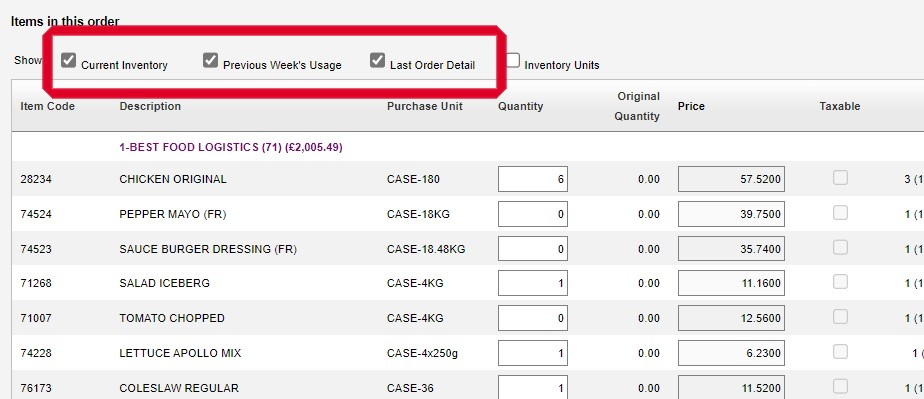
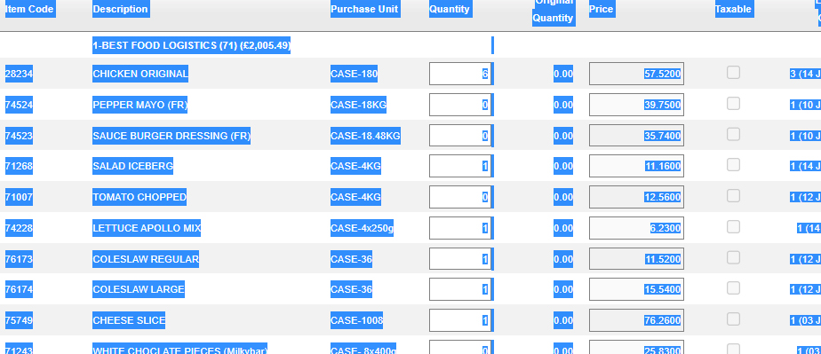
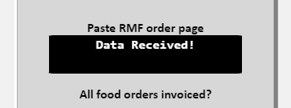
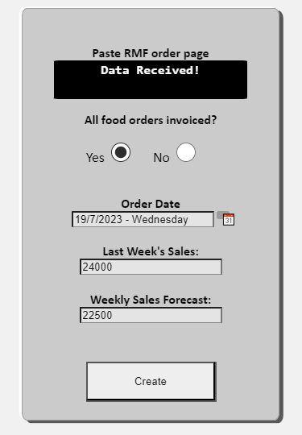
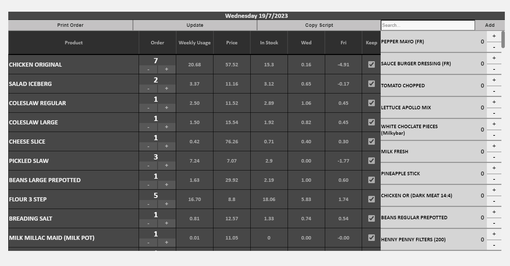
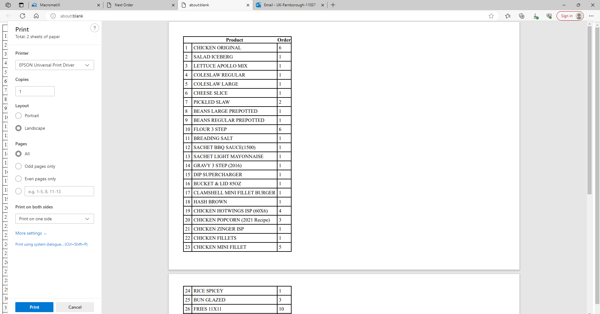
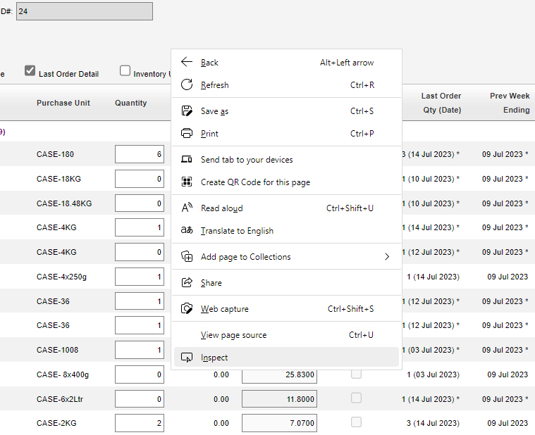
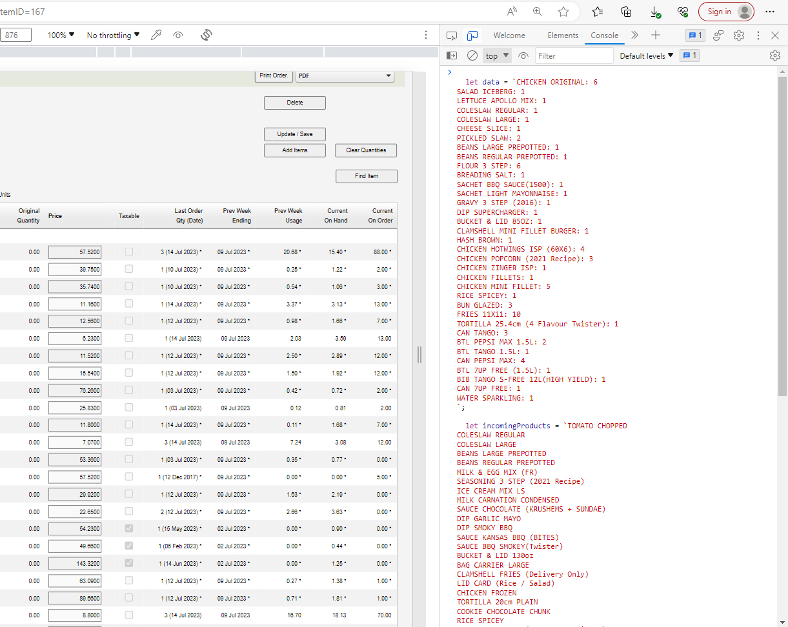
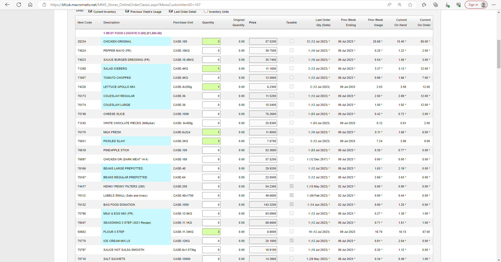

# Inventory Management System - Next Order

## Overview

Next Order is a web application designed for forecasting and managing product inventory levels based on various parameters such as sales data, delivery schedules, and product specifications.
 
**This verson is hosted on Firebase**

## Technology Stack

    Frontend: HTML, CSS, JavaScript
    Backend: None (Client-side only)
    Hosting: Firebase Hosting

## Usage

**Note: This process is not supported in Mozilla Firefox.**

1. Visit [Next Order Web App](https://next-order-4d02b.web.app/).
2. Press the bar at the top, which will display a dropdown menu. Select "Place Order" to proceed.
3. You will be presented with a form.

### Data Extraction from RMF

4. Access RMF and create a new order template.  ( RMF test order page supplied in repo )
5. Ensure the following checkboxes are ticked for proper functionality:
 *	Current Inventory
 *	Previous Week's Usage
 *	Last Order Detail
 

6. Wait for the page to load with the new data, then click anywhere on the page.
7. Press `Ctrl + A` followed by `Ctrl + C` to copy all the text on the page to your clipboard.
 

### Data Submission in Next Order Web App

8. Return to the Next Order form and paste the copied data into the black box.
9. If successful, the program will process the data and display "Data Received!", indicating that the input field becomes disabled.
 

### Completing the Form

10. Fill out the remaining fields:
    - Have all orders been Invoiced on RMF? If not, have you received an order today?
    - Placement date: Use the calendar button to select a date.
    - Last week's store sales.
    - The current week's sales forecast.
 

11. Click the "Create" button.
### Order Management

*    The program utilizes an algorithm to read RMF's order page and make decisions based on the data provided.
*    It forecasts product usage based on store sales for the upcoming days and orders using available theoretical on-hand quantities, implementing techniques such as Usage per thousand and buffers for accurate order amounts.

### Order Modification and Submission
*    Upon successful data processing, you will be directed to the order screen.
 
*    The main table displays the auto-suggested order, allowing you to adjust quantities and remove items.
*    Use the side table to add new items to your order by searching or scrolling and pressing the plus button.
*    If satisfied with your order, choose between the following options:
    - **Print Order:** This option generates a simple table for entering order quantities into RMF.
 
    - **Copy Script:** This option automatically fills the order on RMF. If successful, you'll receive a prompt indicating "Script armed and ready!"
*    To apply the script, return to RMF's order page, right-click anywhere, and select "Inspect."
 
*    In the Console tab of the developer tools, paste the clipboard contents and press Enter to execute the script.
 
*    Your order page will be updated with your custom order quantities. Finally, update and save your order, or proceed to complete the process.
 
